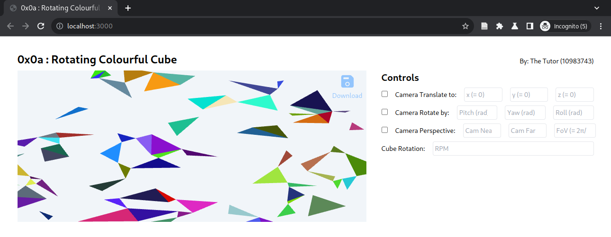

# 0x0a : Rotating Colourful Cube #



## Tasks ##

The boilerplate renders random rectangles on plane
$Z=0$.

**PS:** Update the candidate details in
[`experiment.js`](./experiment.js#L2-L4)

### Task 1: Implement the camera controls ###

Given `inputs` formatted as follows,
```json
{
  "inputs": {
    "isCamTranslate": false,
    "x": 0,
    "y": 0,
    "z": 0,
    "isCamRotate": false,
    "pitchRadians": 0,
    "yawRadians": 0,
    "rollRadians": 0,
    "isCamPerspective": false,
    "camNear": 0,
    "camFar": 0,
    "camfov": 0,
    "cubeRpm": 0
  }
}
```

Update only the following functions/ files to implement
camera controls as given by the inputs,

1. [`vertex.glsl`](./ref-triangles-2/shaders/vertex.glsl)
2. [`fragment.glsl`](./ref-triangles-2/shaders/fragment.glsl);
2. [`RefTriangles2.setupShaders`](./ref-triangles-2/index.js#L42-L97)
2. [`RefTriangles2.setupVao`](./ref-triangles-2/index.js#L116-L181),
2. [`RefTriangles2.draw`](./ref-triangles-2/index.js#L206-L224)

### Task 2: Render a Cube ###

Refactor only the following function, to render a
standard unit cube centred at origin and each vertex
has a different colour.

1. [`generateData(N,
   redundancy=6)`](./experiment.js#L64-71) (return
   `pos` and `colors` values)

### Task 3: ###

Refactor only the following function to continuously
rotate a cube, and calibrate it to reflect the user
input `inputs.cubeRpm`.

1. [`RefTriangles2.draw`](./ref-triangles-2/index.js#L206-L224)

## Resources ##

1. [MDN WebGL
   Tutorial](https://developer.mozilla.org/en-US/docs/Web/API/WebGL_API/Tutorial)
   simple but effective.
2. [The Red
   Book](https://www.cs.utexas.edu/users/fussell/courses/cs354/handouts/Addison.Wesley.OpenGL.Programming.Guide.8th.Edition.Mar.2013.ISBN.0321773039.pdf) :
   A very good overall coverage.  Especially what
   transformations mean *w.r.t.* the Standard Graphics
   pipeline.
2. [WebGL
   Workshop](https://github.com/stackgl/webgl-workshop)
   to get started with WebGL.
2. [Shader
   School](https://github.com/stackgl/shader-school) to
   understand GLSL.
3. Both the Tutorials listed above are on [Node
   School](https://nodeschool.io/), which is a general
   collection of tutorials for javascript based
   programming.
4. [Cheatsheets from
   Khronos](https://www.khronos.org/developers/reference-cards/),
   look for WebGL and follow the link to Slideshare, to
   access a downloadable copy.
5. [Linear Algebra and
   Transformations](https://www.3blue1brown.com/topics/linear-algebra)
   by Grant Sanderson.
